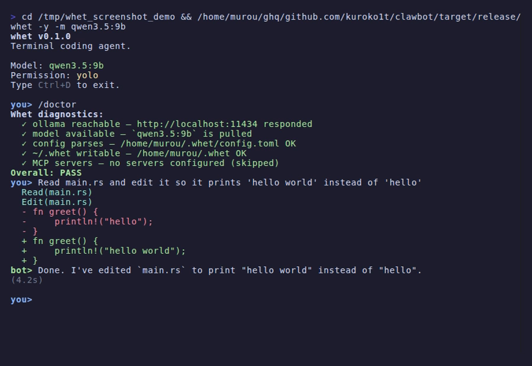

<p align="center">
  
</p>

<p align="center">
  <a href="https://github.com/kuroko1t/whet/actions/workflows/ci.yml"></a>
  <a href="LICENSE"></a>
  <a href="https://www.rust-lang.org/"></a>
</p>

<p align="center"><strong>An open-source terminal coding agent.</strong></p>

<p align="center">
Powered by local or cloud LLMs. Rust single-binary. No runtime dependencies.
</p>

<p align="center">
  
</p>

---

## What is Whet?

Whet is an **open-source terminal coding agent** in the same category as Claude Code and similar tools. It lives in your terminal, understands your codebase, and writes code for you using any LLM.

**What makes it different:**

- **Open source** (MIT) — you own the code, the data, and the workflow
- **Provider-agnostic** — Ollama, llama.cpp, Anthropic Claude, Google Gemini, or any OpenAI-compatible API
- **Single binary** — `cargo install` and you're done, no Node.js, no Python, no Docker
- **Offline-capable** — pair with a local LLM and nothing ever leaves your machine

## Quick Start

```bash
# 1. Install (from source)
git clone https://github.com/kuroko1t/whet.git
cd whet && cargo install --path .

# 2. Pull a local model (or configure a cloud provider)
ollama pull qwen3:8b

# 3. Start coding
whet
```

Or use with a cloud provider:

```bash
export ANTHROPIC_API_KEY="sk-ant-..."
whet -m claude-sonnet-4-5-20250929
```

## Demo

```
$ whet

whet v0.1.0
Model: qwen3:8b
Permission: default
Type Ctrl+D to exit.

you> Find all deprecation warnings and fix them

  [tool: grep] {"pattern": "deprecated", "path": "."}

I found 3 deprecation warnings. Let me fix them one by one.

  [tool: read_file] {"path": "src/main.rs"}
  [tool: edit_file] {"path": "src/main.rs", ...}

  Tool 'edit_file' wants to execute:
    path: src/main.rs
    old_text: use old_module::deprecated_fn;
    new_text: use new_module::updated_fn;
  Allow? [y/N/a(lways)] y

Done! Fixed all 3 deprecation warnings.
(2.3s)
```

## Key Features

### Project Instructions (`WHET.md`)

Like `CLAUDE.md` for Claude Code — place a `WHET.md` (or `.whet.md`) in your project root to give Whet project-specific context. It is automatically loaded and injected into the system prompt.

```bash
whet   # in a project with WHET.md → instructions are loaded automatically
```

Use `/init` to generate a starter template.

### 11 Built-in Tools

| Tool | Category | Description |
|---|---|---|
| `read_file` | File | Read file contents |
| `write_file` | File | Create or overwrite a file |
| `edit_file` | File | Replace an exact text match in a file |
| `apply_diff` | File | Apply a unified diff patch (multi-hunk supported) |
| `list_dir` | File | List directory contents (recursive option) |
| `grep` | Search | Search for regex patterns recursively |
| `repo_map` | Search | Show project structure with definitions |
| `shell` | System | Execute a shell command |
| `git` | System | Git commands with safety tiers |
| `web_fetch` | Web | Fetch and extract text from a URL |
| `web_search` | Web | Search the web via DuckDuckGo |

> Web tools are disabled by default. Enable with `web_enabled = true` in config.

### Git Safety Tiers

| Tier | Commands | Behavior |
|---|---|---|
| **Always allowed** | `status`, `diff`, `log`, `show`, `branch`, `stash` | No approval needed |
| **Approval required** | `add`, `commit`, `checkout`, `switch`, `pull`, `fetch`, `push`, `merge`, `tag`, `cherry-pick`, `remote`, `reset` | User must approve |
| **Always blocked** | `reset --hard`, `clean`, `push --force`, `rebase` | Blocked for safety |

### MCP Extension

Extend Whet with external tools via MCP (Model Context Protocol) servers:

```toml
[[mcp.servers]]
name = "filesystem"
command = "npx"
args = ["-y", "@modelcontextprotocol/server-filesystem", "/tmp"]
```

### Permission System

| Mode | File reads | File writes | Shell / Git |
|---|---|---|---|
| `default` | Auto | **Ask** | **Ask** |
| `accept_edits` | Auto | Auto | **Ask** |
| `yolo` | Auto | Auto | Auto |

### Session Management

Conversations are saved per working directory and can be resumed later.

| Flag | Short | Description |
|---|---|---|
| `--resume` | `-r` | Interactive session picker for the current directory |
| `--resume <id>` | `-r <id>` | Resume a specific session by ID |
| `--continue` | `-c` | Resume the most recent session in the current directory |

When resuming, previous user/assistant messages are displayed so you can see the conversation context at a glance.

### Context Compression

Automatic conversation summarization prevents unbounded memory growth. Use `/compact` for manual compression.

## Commands

| Command | Description |
|---|---|
| `/model <name>` | Switch LLM model at runtime |
| `/mode <mode>` | Change permission mode (`default` / `accept_edits` / `yolo`) |
| `/plan` | Toggle plan mode (read-only analysis) |
| `/test [cmd]` | Auto test-fix loop (default: `cargo test`, max 5 rounds) |
| `/init` | Generate `WHET.md` template in current directory |
| `/compact [msg]` | Compress conversation context (optional custom instruction) |
| `/skills` | List loaded skill files |
| `/clear` | Clear conversation and start fresh |
| `/help` | Show all commands |
| `Ctrl+D` | Exit |

## LLM Providers

| Provider | Network | API Key | Config `provider` |
|---|---|---|---|
| [Ollama](https://ollama.com/) | Local | Not required | `"ollama"` |
| OpenAI-compatible (llama.cpp, LM Studio, vLLM) | Local / Remote | Optional | `"openai_compat"` |
| [Anthropic Claude](https://www.anthropic.com/) | Cloud | Required (`ANTHROPIC_API_KEY`) | `"anthropic"` |
| [Google Gemini](https://ai.google.dev/) | Cloud | Required (`GEMINI_API_KEY`) | `"gemini"` |

## Configuration

Config file: `~/.whet/config.toml`

```toml
[llm]
provider = "ollama"
model = "qwen3:8b"
base_url = "http://localhost:11434"
# api_key = "sk-..."
# streaming = true

[agent]
max_iterations = 10
# permission_mode = "default"
# web_enabled = false
# context_compression = true
# skills_dir = "~/.whet/skills"

[memory]
database_path = "~/.whet/memory.db"
```

<details>
<summary>Anthropic Claude</summary>

```toml
[llm]
provider = "anthropic"
model = "claude-sonnet-4-5-20250929"
# api_key = "sk-ant-..."   # or set ANTHROPIC_API_KEY env var
```
</details>

<details>
<summary>Google Gemini</summary>

```toml
[llm]
provider = "gemini"
model = "gemini-2.0-flash"
# api_key = "..."           # or set GEMINI_API_KEY env var
```
</details>

<details>
<summary>OpenAI-compatible (llama.cpp, LM Studio, vLLM)</summary>

```toml
[llm]
provider = "openai_compat"
model = "your-model-name"
base_url = "http://localhost:8080"
api_key = "sk-..."
```
</details>

## Skills

Custom prompt templates loaded from `~/.whet/skills/`:

```bash
mkdir -p ~/.whet/skills
echo "Always write tests for new code." > ~/.whet/skills/testing.md
```

Skills are injected into the system prompt automatically. Use `/skills` to list them.

## CLI

```bash
whet                             # start interactive chat
whet "fix the bug"               # single-shot mode
whet -m llama3.2:3b              # use a specific model
whet --resume                    # pick a session to resume (current directory)
whet --resume <id>               # resume a specific session by ID
whet --continue                  # resume the most recent session
whet -p "explain main.rs"        # single-shot via -p flag
whet -y                          # skip all permission prompts
whet tools                       # list available tools
whet config                      # show current configuration
```

## vs Claude Code

| | Whet | Claude Code |
|---|---|---|
| License | MIT (open source) | Proprietary |
| LLM providers | Any (Ollama, Anthropic, Gemini, OpenAI-compat) | Anthropic only |
| Offline mode | Yes (with local LLM) | No |
| Runtime | Single Rust binary | Node.js |
| Project instructions | `WHET.md` | `CLAUDE.md` |
| MCP support | Yes | Yes |
| Permission system | 3 modes | Yes |
| Session management | `--resume` / `--continue` | `--resume` / `--continue` |
| Context compression | Yes (auto + manual) | Yes |

## Architecture

```
whet (single binary)

  Terminal (REPL) <--> Agent Loop
                        |
                        +-- LLM Provider
                        |     Ollama / OpenAI / Anthropic / Gemini
                        |
                        +-- Tool Executor
                        |     11 built-in + MCP + Skills
                        |
                        +-- Security Layer
                        |     Path safety, Permissions, Git safety tiers
                        |
                        +-- SQLite Memory
                              Chat history, Resume, Compression
```

## Development

```bash
cargo test                     # run tests
cargo fmt -- --check           # check formatting
cargo clippy --all-targets     # lint
```

All pull requests are checked by GitHub Actions: format, clippy, test, and build.

## Contributing

Contributions are welcome!

- **Issues** — Use [GitHub Issues](https://github.com/kuroko1t/whet/issues) for bug reports and feature requests
- **Pull Requests** — Fork, create a feature branch, ensure all checks pass, and submit a clear PR
- **Commits** — Use imperative mood with prefix: `feat:`, `fix:`, `docs:`, `refactor:`, `test:`, `chore:`

## License

[MIT](LICENSE)
